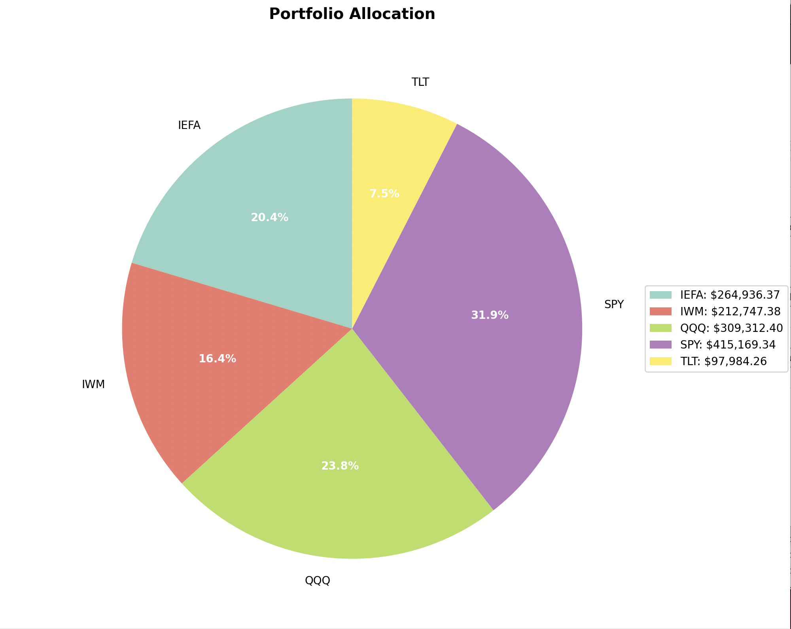
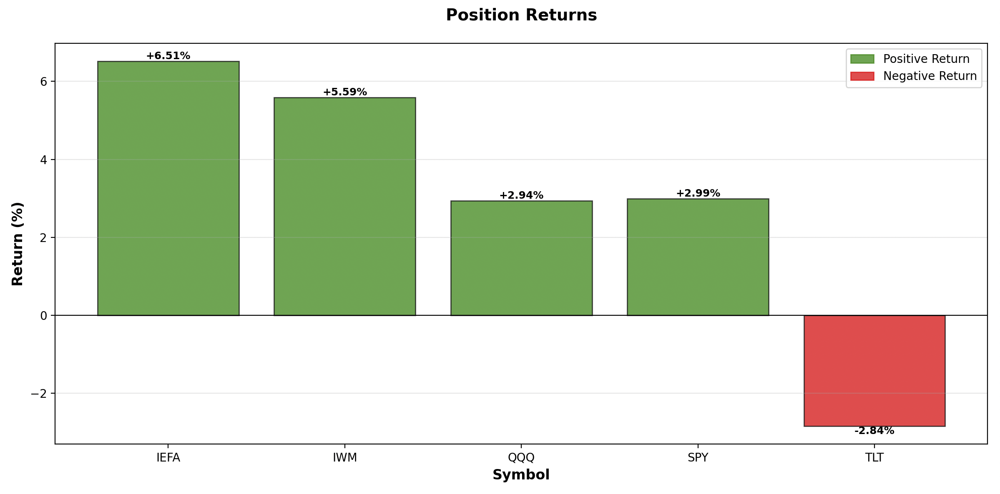
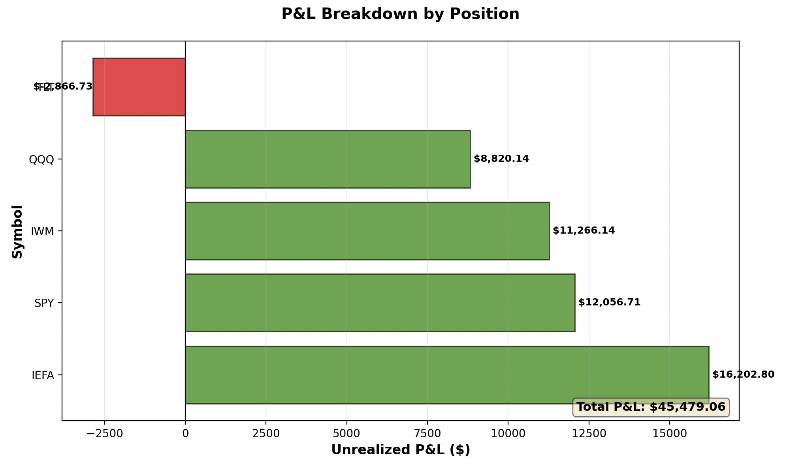
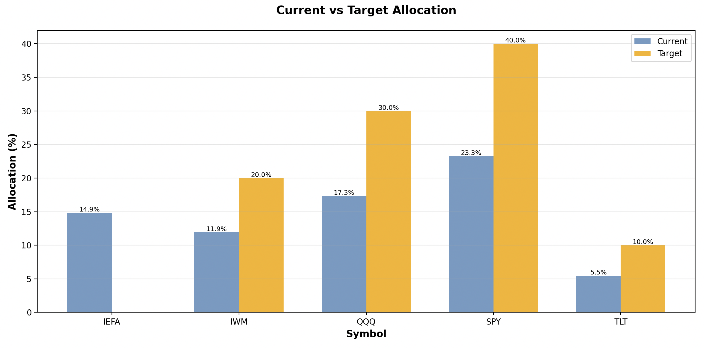
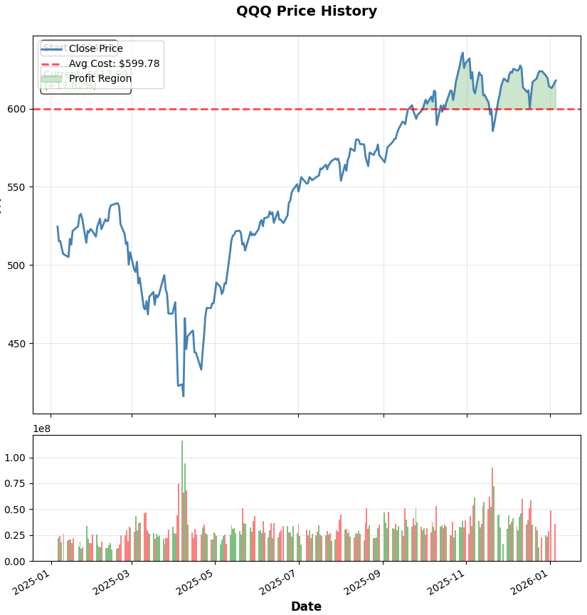
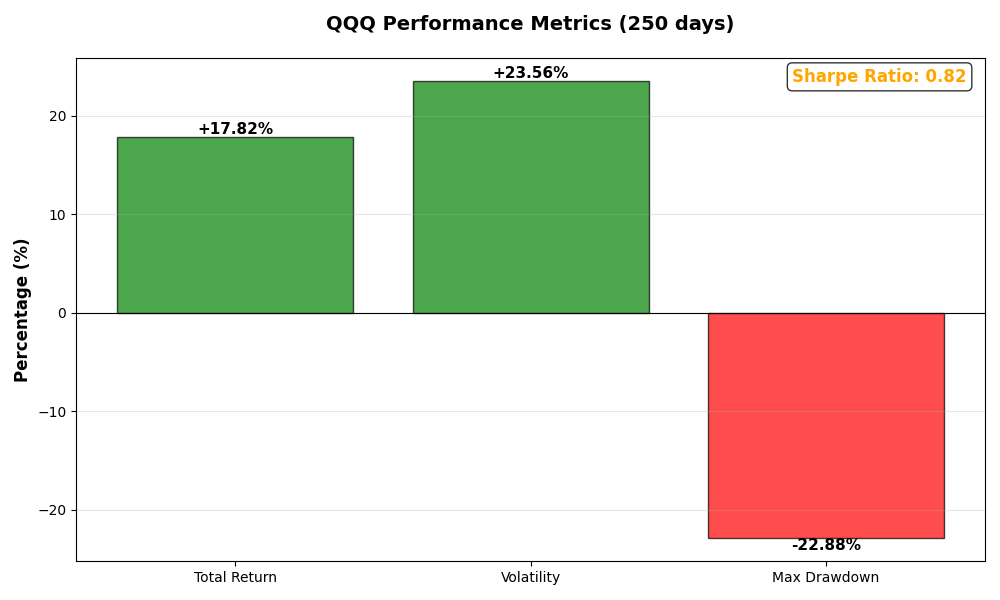

# IBKR Portfolio Manager

Developed in Python (C++ version currently in progress), this portfolio management system automates real-time rebalancing via the IBKR API. It is designed to evolve into a interactive application for my investment management


*Real-time portfolio allocation visualization*

---

## Project Overview

The system runs as a persistent server, allowing interactive portfolio management through a command-line interface.

**Key Capabilities:**
- Real-time portfolio monitoring and analysis
- Automatic Dividend reinvestment
- Automated rebalancing calculations based on target allocations
- Event-driven trade execution with live status updates
- Comprehensive performance analytics and return calculations
- Interactive data visualization with matplotlib
- Multi-layered safety features (dry-run mode, trade thresholds, confirmation prompts)

---

## Technical Architecture

### Modular Design

The system is architected with clear separation of concerns across six specialized modules:

#### 1. **`connection.py`** - Connection Management
Manages persistent connections to Interactive Brokers TWS/Gateway with automatic error handling.

```python
from connection import IBConnection

conn = IBConnection(host='127.0.0.1', port=4002, client_id=1)
ib = conn.connect()
```

#### 2. **`transactions.py`** - Trade Execution Engine
Handles all trading operations with event-driven callbacks for real-time order monitoring.

**Technical Highlights:**
- Event-based callbacks (`statusEvent`, `fillEvent`, `filledEvent`) for non-blocking order monitoring
- GTC (Good-Til-Cancelled) orders with outside regular trading hours support
- Dry-run simulation using IBKR's `whatIfOrder` API
- Automatic order status tracking and error handling

```python
from transactions import TransactionManager

tm = TransactionManager(ib)
trade = tm.place_buy_async(symbol="SPY", qty=10, dry_run=True)
# Order executes with real-time status callbacks
```

#### 3. **`portfolio_manager.py`** - Portfolio Analytics Core
Central business logic for portfolio analysis, rebalancing calculations, and performance tracking.

**Key Features:**
- Position aggregation and valuation
- Target allocation calculation with validation (must sum to 100%)
- Rebalancing trade calculation with minimum trade thresholds
- Return/yield calculations (unrealized P&L, realized P&L, cost basis)
- Buying power and margin requirement tracking

```python
from portfolio_manager import PortfolioManager

pm = PortfolioManager(ib)
positions = pm.get_portfolio_positions()
returns = pm.get_portfolio_returns()  # Calculate portfolio yield
```

#### 4. **`display.py`** - Data Presentation Layer
Formats and displays portfolio data with tabular output.

#### 5. **`charts.py`** - Visualization Engine
Generates interactive matplotlib charts for portfolio analysis.

**Available Visualizations:**
- Portfolio allocation pie charts
- Position returns bar charts (color-coded gains/losses)
- P&L breakdown horizontal bars
- Current vs target allocation comparisons
- Historical price charts with purchase price overlay
- Performance metrics visualization


*Position-level return analysis*

#### 6. **`historical_data.py`** - Historical Analysis Engine
Fetches and analyzes historical stock data with advanced performance metrics.

**Key Features:**
- Fetches up to 1 year of historical price data from IBKR
- Calculates volatility (annualized standard deviation)
- Computes maximum drawdown for risk assessment
- Generates Sharpe ratio for risk-adjusted returns
- Tracks returns from your purchase price

```python
from historical_data import HistoricalDataManager

hist = HistoricalDataManager(ib)
history = hist.get_position_history('SPY', avg_cost=667.41, duration='1 Y')
metrics = history['metrics']  # volatility, sharpe ratio, max drawdown, etc.
```

#### 7. **`metrics.py`** - Advanced Portfolio Metrics
Calculates sophisticated financial risk and performance metrics for portfolio analysis.

**Available Metrics:**
- **Value at Risk (VaR)**: 95% and 99% confidence levels using historical and parametric methods
- **Conditional VaR (CVaR)**: Expected loss in worst-case scenarios
- **Beta**: Portfolio sensitivity to market movements
- **Alpha**: Risk-adjusted excess returns (Jensen's Alpha)
- **Sortino Ratio**: Downside risk-adjusted returns
- **Calmar Ratio**: Return relative to maximum drawdown
- **Information Ratio**: Active management consistency vs benchmark

```python
from metrics import calculate_all_metrics

metrics = calculate_all_metrics(
    portfolio_returns=portfolio_returns,
    benchmark_returns=spy_returns,
    max_drawdown=12.5,
    risk_free_rate=0.04
)
```

#### 8. **`fees.py`** - Fee Comparison & Analysis
Compares IBKR's per-trade fees with Wealthsimple's annual management fee to determine cost-effectiveness.

**Key Features:**
- IBKR tiered fee structure calculation (CAD $0.008/share for ≤300k shares)
- Minimum ($1.00) and maximum (0.5% of trade value) per-order fees
- Breakeven analysis: how many trades per year before IBKR becomes more expensive
- Real-time rebalancing fee calculation for specific trade plans
- Multiple scenario analysis (small/medium/large trades)

See [FEE_COMPARISON.md](docs/FEE_COMPARISON.md) for detailed fee analysis.

```python
from fees import display_fee_comparison, display_rebalance_fees

# General comparison
display_fee_comparison(portfolio_value=1_000_000, positions=positions)

# Specific rebalancing fees
display_rebalance_fees(portfolio_value=1_000_000, trades=rebalance_trades)
```

#### 9. **`main.py`** - Interactive Server Interface
Persistent command server that orchestrates all modules into a cohesive application.

---

## Configuration

### `config.json` Structure

The system uses a JSON configuration file for flexible deployment across different environments and strategies.

```json
{
  "connection": {
    "host": "127.0.0.1",        // IBKR TWS/Gateway host
    "port": 4002,                // 4002 = Paper Trading, 4001 = Live Trading
    "client_id": 1               // Unique client identifier
  },
  "allocations": {
    "SPY": 40.0,                 // Target allocation percentages
    "QQQ": 30.0,                 // Must sum to 100.0%
    "IWM": 20.0,
    "TLT": 10.0
  },
  "settings": {
    "dry_run": true,             // Safety mode: false for live trading
    "min_trade_value": 10.0      // Minimum $ value to execute a trade
  }
}
```

**Configuration Options Explained:**

- **`connection.port`**: 
  - `4002` → Paper trading account (safe testing)
  - `4001` → Live trading account (real money)

- **`allocations`**: 
  - Defines target portfolio weights as percentages
  - System validates that all allocations sum to exactly 100%
  - Add/remove symbols as needed for your strategy

- **`settings.dry_run`**:
  - `true` → Orders include what-if analysis but still execute in paper account
  - `false` → Live trading with confirmation prompts

- **`settings.min_trade_value`**:
  - Prevents excessive small trades
  - Only executes rebalancing if trade value exceeds this threshold

---

## Getting Started

### Prerequisites

1. **Interactive Brokers Account** (paper or live)
2. **IB Gateway or TWS** running locally
3. **Python 3.10+** (compatible with Python 3.14 via event loop fix)


### Configuration Setup

1. Edit `config.json` with your target allocations
2. Ensure IB Gateway/TWS is running on the specified port
3. Enable API connections in TWS (Edit → Global Configuration → API → Settings)


## Interactive Commands

| Command | Shortcut | Description |
|---------|----------|-------------|
| `portfolio` | `p` | Display current positions and account summary |
| `balance` | `b` | Show account balance, buying power, and margin info |
| `returns` | `yield` | Calculate and display portfolio returns/performance |
| `metrics` | `m` | Show advanced risk metrics (VaR, Beta, Sortino, Calmar) |
| `fees` | - | Compare IBKR vs Wealthsimple fee structures |
| `history <SYMBOL>` | - | Show price history for a specific stock (e.g., `history SPY`) |
| `<SYMBOL>` | - | Quick access to stock history (e.g., `SPY`) |
| `chart allocation` | - | Show portfolio allocation pie chart |
| `chart returns` | - | Show position returns bar chart |
| `chart pnl` | - | Show P&L breakdown by position |
| `chart target` | - | Compare current vs target allocation |
| `plan` | - | Calculate rebalancing trades without executing |
| `rebalance` | `r` | Execute portfolio rebalancing |
| `config` | - | Reload configuration file |
| `help` | `h` | Display all available commands |
| `quit` | `q` | Disconnect and exit |


*Profit & Loss breakdown visualization*


*Current vs Target allocation comparison*

### Historical Data Analysis

Analyze individual stock performance with comprehensive historical data and advanced metrics. QQQ for instance:


*Historical price chart with purchase cost basis and volume*


*Performance metrics: Total return, volatility, max drawdown, and Sharpe ratio*

---

## Technical Highlights

### 1. Event-Driven Architecture
Instead of blocking execution while waiting for order fills, the system uses event-based callbacks to monitor order status asynchronously. This allows concurrent order submission and real-time status updates.

```python
# Orders are submitted concurrently
def on_status(trade):
    print(f"[STATUS] {symbol} {trade.orderStatus.status}")

trade.statusEvent += on_status  # Non-blocking event handler
```

### 2. Robust Risk Management

**Multi-Layer Safety Mechanisms:**
- **Dry-run mode**: Test strategies without financial risk
- **Trade value thresholds**: Prevent excessive small trades
- **Allocation validation**: Ensures targets sum to 100%
- **Confirmation prompts**: Required for live trading
- **GTC orders**: Prevents automatic cancellation outside market hours

### 3. Python 3.14+ Compatibility
Implemented event loop initialization fix for compatibility with Python 3.14's stricter asyncio requirements:

```python
# Fix for Python 3.14+ event loop requirement
try:
    asyncio.get_event_loop()
except RuntimeError:
    asyncio.set_event_loop(asyncio.new_event_loop())
```

### 4. Precise Financial Calculations
Uses proper decimal arithmetic and handles fractional shares for accurate portfolio calculations.

### 5. Real-Time Performance Analytics
Calculates:
- Cost basis for each position
- Unrealized P&L and realized P&L
- Return percentages (position-level and portfolio-level)
- Daily P&L tracking

### 6. Advanced Portfolio Metrics
Comprehensive risk and performance analytics including:
- **Value at Risk (VaR)**: Daily loss estimates at 95% and 99% confidence
- **Conditional VaR**: Average loss in worst 5% of scenarios
- **Beta & Alpha**: Market correlation and risk-adjusted excess returns
- **Sortino Ratio**: Focuses on downside volatility only
- **Calmar Ratio**: Returns relative to maximum drawdown
- **Information Ratio**: Measures consistency of active returns

### 7. Fee Comparison Analysis
Automated cost comparison between:
- **IBKR**: Per-trade tiered fees ($0.008/share, $1 min, 0.5% max)
- **Wealthsimple**: 0.5% annual management fee

Calculates breakeven points and provides real-time fee estimates for rebalancing trades. See [FEE_COMPARISON.md](docs/FEE_COMPARISON.md) for details.

### 8. Data Visualization
Interactive matplotlib charts with:
- Color-coded gains/losses (green/red)
- Value labels on all data points
- Styling and legends
- Export capabilities (save as PNG, PDF, SVG)

### 9. Historical Data Analysis & Advanced Metrics
Comprehensive stock analysis with:
- **1-year historical price data** fetched directly from IBKR
- **Volatility calculation** (annualized standard deviation)
- **Maximum drawdown** analysis for risk assessment
- **Sharpe ratio** for risk-adjusted return measurement
- **Purchase price overlay** on charts showing profit/loss regions
- **Volume analysis** with color-coded bars

Metrics calculated:
```python
{
    'total_return': 17.82%,        # Overall price change
    'volatility': 23.56%,           # Annualized volatility
    'max_drawdown': -22.88%,        # Largest peak-to-trough decline
    'sharpe_ratio': 0.82,           # Risk-adjusted return (252 trading days)
    'purchase_return': 3.04%        # Return from your cost basis
}
```

---

## Example Workflow

### 1. Start the Server
```bash
$ python main.py
Loading configuration from config.json
Configuration loaded successfully:
  Host: 127.0.0.1
  Port: 4002 (Paper Trading)
  Dry Run: True
  
Connecting to Interactive Brokers...
Connected to IB at 127.0.0.1:4002 with client ID 1

PORTFOLIO MANAGER SERVER - READY
Type 'help' for available commands or 'quit' to exit

> 
```

### 2. Check Current Portfolio
```bash
> portfolio
CURRENT PORTFOLIO STATUS
Symbol     Quantity     Market Value    Unrealized P/L
SPY        604.0000     $415,169.34     +$12,056.71
QQQ        501.0000     $309,312.40     +$8,820.14
...
```

### 3. View Performance
```bash
> returns
PORTFOLIO RETURNS & PERFORMANCE
Cost Basis:        $1,254,670.69
Current Value:     $1,300,149.75
Total Return:      +3.63%
```

### 4. Visualize Allocation
```bash
> chart allocation
# Opens interactive pie chart showing current allocation
```

### 5. Calculate Rebalancing
```bash
> plan
TARGET ALLOCATIONS
SPY        40.00%     → $428,116.76
QQQ        30.00%     → $321,087.57
...

REBALANCING PLAN
Symbol     Action   Quantity     Difference
SPY        BUY      19           +$12,947.42
QQQ        BUY      19           +$11,775.17
```

### 6. Analyze Stock History
```bash
> QQQ
# Or: > history QQQ

QQQ - HISTORICAL ANALYSIS (1 Year)
================================================================================
Start Price:      $524.54
Current Price:    $617.99
Total Return:     +17.82%
Avg Cost:         $599.78
Your Return:      +3.04%
Volatility:       23.56%
Max Drawdown:     -22.88%
Sharpe Ratio:     0.82
================================================================================

# Opens price history chart with your purchase price line
# Opens performance metrics bar chart
```

### 7. View Advanced Risk Metrics
```bash
> metrics

ADVANCED PORTFOLIO METRICS
================================================================================
Fetching historical data for portfolio analysis...
  Fetching SPY (weight: 32.7%)... ✓
  Fetching QQQ (weight: 23.8%)... ✓
  ...

RISK METRICS
================================================================================
Value at Risk (95%):            1.24%
Value at Risk (99%):            2.10%
Conditional VaR (95%):          1.67%
Max Drawdown:                   8.92%

RISK-ADJUSTED RETURN METRICS
================================================================================
Sortino Ratio:                  1.245
Calmar Ratio:                   0.892

MARKET COMPARISON (vs SPY)
================================================================================
Beta:                           0.987
  → Market-like
Alpha (annualized):             2.34%
  → Outperforming risk-adjusted expectations
Information Ratio:              0.654
  → Good active management
```

### 8. Compare Broker Fees
```bash
> fees

IBKR vs WEALTHSIMPLE FEE COMPARISON
================================================================================
Portfolio Value: $1,077,254.16 CAD
Wealthsimple Annual Fee (0.5%): $5,386.27 CAD

BREAKEVEN ANALYSIS BY TRADE SIZE
================================================================================
Small trades (10 shares @ $176.13)
  IBKR Fee per Trade:       $1.00
  Max Annual Trades:        5386
  Max Monthly Trades:       448.9
...
```

### 9. Execute Rebalancing with Fee Analysis
```bash
> plan
# Or: > rebalance

TARGET ALLOCATIONS
================================================================================
SPY        32.70%     → $430,901.66
QQQ        23.80%     → $313,386.94
...

REBALANCING PLAN
================================================================================
Symbol     Action   Quantity     Difference
SPY        SELL     18           -$12,287.66
IWM        BUY      5            +$1,152.74
TLT        BUY      9            +$749.56

Total Buy Amount:  $1,902.30
Total Sell Amount: $12,287.66
Number of Trades:  3

REBALANCING FEE ANALYSIS
================================================================================
Portfolio Value: $1,077,254.16 CAD
Number of Trades: 3

TRADE-BY-TRADE FEE BREAKDOWN
--------------------------------------------------------------------------------
Symbol     Action Shares     Price        Trade Value     IBKR Fee
SPY        SELL   18         $690.33      $12,425.94      $1.00
IWM        BUY    5          $252.71      $1,263.55       $1.00
TLT        BUY    9          $87.26       $785.34         $1.00
--------------------------------------------------------------------------------
TOTAL IBKR FEES:                                          $3.00

COMPARISON TO WEALTHSIMPLE
================================================================================
Wealthsimple Annual Fee (0.5%):        $5,386.27
Wealthsimple Quarterly Equivalent:     $1,346.57
IBKR Fees for This Rebalance:          $3.00

✓ SAVINGS with IBKR (vs quarterly):    $1343.57
✓ Projected Annual Savings (4x/year):  $5374.27

  → You can rebalance 1795.4 times per year
    and still pay LESS than Wealthsimple
```

### 10. Execute Trades
```bash
> rebalance
Submitting 3 orders concurrently...
[STATUS] SPY Submitted  filled=0.0
[FILL]   SPY 18 @ $690.33
[FILLED] SPY totalFilled=18 avgPx=$690.33
...
✓ Rebalancing complete
```

---

## Safety Features

1. **Default Dry-Run Mode**: New users start in paper trading mode
2. **Live Trading Confirmation**: Requires typing 'YES' to execute real trades
3. **Port Separation**: Paper (4002) and Live (4001) use different ports
4. **Trade Thresholds**: Configurable minimum trade values
5. **What-If Analysis**: Pre-execution validation of order impacts
6. **Non-Blocking Execution**: Ctrl+C interrupts operations without terminating server

---

## Project Structure

```
IBKR_portolio_manager/
├── main.py                           # Interactive server interface (entry point)
├── config.json                       # Configuration file
├── README.md                         # Main documentation
│
├── modules/                          # Core application modules
│   ├── connection.py                 # IB connection management
│   ├── transactions.py               # Trade execution engine
│   ├── portfolio_manager.py          # Portfolio analytics core
│   ├── display.py                    # Data presentation layer
│   ├── charts.py                     # Visualization engine
│   ├── historical_data.py            # Historical data fetching & analysis
│   ├── metrics.py                    # Advanced portfolio metrics (VaR, Beta, etc.)
│   ├── fees.py                       # IBKR vs Wealthsimple fee comparison
│   └── decimal_utils.py              # Decimal arithmetic utilities
│
├── docs/                             # Documentation
│   ├── FEE_COMPARISON.md             # Detailed fee analysis guide
│   └── METRICS.md                    # Advanced metrics documentation
│
├── examples/                         # Example scripts
│   ├── example_usage.py              # Basic usage examples
│   └── api.py                        # API exploration examples
│
├── tests/                            # Test files
│   └── test2.py                      # Test scripts
│
└── Charts/                           # Visualization exports
    ├── portfolio_allocation.png
    ├── position_returns.png
    └── p&l_breakdown_by_position.png
```

---

## Working on...

- **More info for individual stocks**: everything IBKR allows and more
- **More info on yield (and predicted yield) and cashflow allocation**: Predicting futur yield and see yield in the performance
fdata

---

## Development Notes

### Python Version Compatibility
- **Recommended**: Python 3.10 - 3.13
- **Supported**: Python 3.14+ (with event loop fix)
- The `ib_insync` library works best with Python 3.10-3.12

### Dependencies
```txt
ib_insync>=0.9.86
matplotlib>=3.5.0
```

### API Configuration
Ensure IBKR API is enabled:
1. Open TWS/IB Gateway
2. Navigate to: Edit → Global Configuration → API → Settings
3. Enable "ActiveX and Socket Clients"
4. Add `127.0.0.1` to trusted IPs
5. Uncheck "Read-Only API" (if executing trades)

---


**Note**: This is a portfolio management tool intended for educational purposes. Always test thoroughly in paper trading mode before using with real capital. Trading involves risk of loss.
- Interactive Brokers TWS or IB Gateway running
- Active IB account (paper or live)


Available Commands:

portfolio or p - Show current portfolio status
rebalance or r - Calculate and execute rebalancing trades
plan - Show rebalancing plan without executing
config - Reload configuration file (to update allocations without restarting)
help or h - Show help message
quit or q or exit - Disconnect and exit
yield, or performance to see:
balance or b
chart allocation - Pie chart showing portfolio allocation by position with percentages and values
chart returns - Bar chart displaying return % for each position (green for gains, red for losses)
chart pnl - Horizontal bar chart showing unrealized P&L breakdown by position
chart target - Grouped bar chart comparing current allocation vs target allocation
always adding some more!